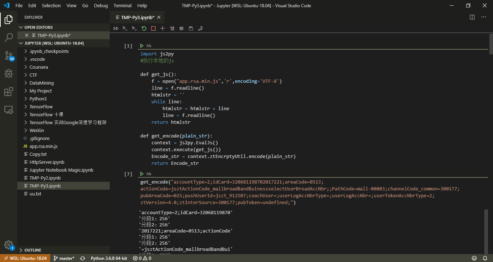

# 第一章、起步


## 1.1　搭建编程环境

### 1.1.1　Python 2和Python 3
### 1.1.2　运行Python代码片段


```python
#Hello, World!
print("Hello, Jupyter!")
```

    Hello, Jupyter!


### 1.1.3　Hello World程序


```python
print("Hello, World!")
```

    Hello, World!


## 1.2　在不同操作系统中搭建Python编程环境
### 1.2.1　在Linux系统中搭建Python编程环境
1. 检查Python版本


```python
import sys
print(sys.version)
print(sys.version_info)
```

    3.6.8 (default, Oct  7 2019, 12:59:55) 
    [GCC 8.3.0]
    sys.version_info(major=3, minor=6, micro=8, releaselevel='final', serial=0)


2. 安装文本编辑器

```
sudo apt-get install geany
```
这里推荐VSCode。https://code.visualstudio.com/
安装完python的插件后，非常好用。


### 1.2.2　在OS X系统中搭建Python编程环境
1. 检查是否安装了Python
python3需要通过brew进行安装。

2. 在终端会话中运行Python代码
3. 安装文本编辑器（Sublime Text）

建议仍然使用上面介绍的VSCode。这样可以保持环境一致，无需切换。

4. 配置Sublime Text使其使用Python 3
5. 运行Hello World程序

### 1.2.3　在Windows系统中搭建Python编程环境
1. 安装Python

下载地址：https://www.python.org/downloads/

2. 启动Python终端会话
3. 在终端会话中运行Python
4. 安装文本编辑器

## 1.3　解决安装问题

## 1.4　从终端运行Python程序
### 1.4.1　在Linux和OS X系统中从终端运行Python程序
`python hello_world.py`
### 1.4.2　在Windows系统中从终端运行Python程序
注意系统的PATH环境变量，加入python的路径

----

欢迎关注我的微信公众号一起交流！