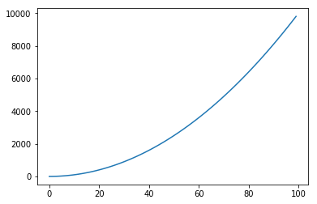
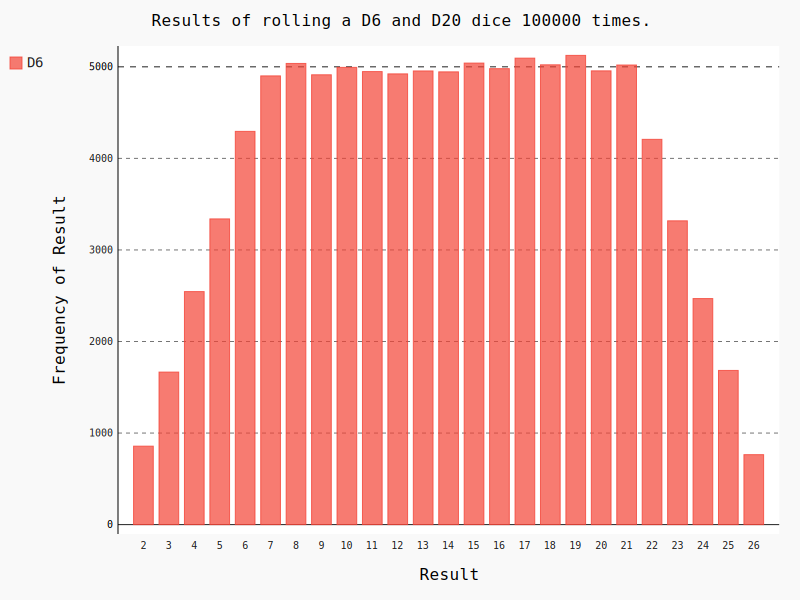

# 第十五章、生成数据

`数据可视化`指的是通过可视化表示来探索数据，它与数据挖掘紧密相关，而`数据挖掘`指的是使用代码来探索数据集的规律和关联。数据集可以是用一行代码就能表示的小型数字列表，也可以是数以G字节的数据。

漂亮地呈现数据关乎的并非仅仅是漂亮的图片。以引人注目的简洁方式呈现数据，发现数据集中原本未意识到的规律和意义。

数据科学家使用Python编写了一系列令人印象深刻的可视化和分析工具，其中很多可供使用。最流行的工具之一是`matplotlib`，它是一个数学绘图库，将使用它来制作简单的图表，如折线图和散点图。然后，将基于随机漫步概念生成一个更有趣的数据集——根据一系列随机决策生成的图表。

我们还将使用`Pygal`包，它专注于生成适合在数字设备上显示的图表。通过使用Pygal，可在用户与图表交互时突出元素以及调整其大小，还可轻松地调整整个图表的尺寸，使其适合在微型智能手表或巨型显示器上显示。我们将使用Pygal以各种方式探索掷骰子的结果。

## 15.1 安装matplotlib
### 15.1.1 在Linux系统中安装matplotlib
### 15.1.2 在OS X系统中安装matplotlib
### 15.1.3 在Windows系统中安装matplotlib
### 15.1.4 测试matplotlib
### 15.1.5　matplotlib画廊
要查看使用matplotlib可制作的各种图表，请访问http://matplotlib.org/ 的示例画廊。单击画廊中的图表，就可查看用于生成图表的代码。


```python
import matplotlib
```

## 15.2　绘制简单的折线图


```python
import matplotlib.pyplot as plt
```


```python
squares = [pow(a,2) for a in range(100)]
plt.plot(squares)
plt.show()
```





### 15.2.1　修改标签文字和线条粗细


```python
# 更改线条粗细
plt.plot(squares,'g-.', linewidth=2)

# 设置图表标题，并给坐标轴加上标签
plt.title("Square Numbers", fontsize=16)
plt.xlabel("Value", fontsize=12)
plt.ylabel("Square", fontsize=12)

# 设置刻度标记大小
plt.tick_params(axis='both', labelsize=12)
plt.show()
```


### 15.2.2　校正图形


```python
# 同时提供x，y轴数据
values = [a for a in range(100)]
squares = [pow(a,2) for a in range(100)]
plt.plot(values, squares, 'r--', linewidth=3)
plt.show()
```


### 15.2.3　使用scatter() 绘制散点图并设置其样式


```python
values = [a for a in range(10)]
squares = [pow(a,2) for a in range(10)]
plt.scatter(values, squares, color='green', s=100)

# 设置图标标题并给坐标轴加上标签
plt.title("Square Numbers", fontsize=16)
plt.xlabel("Value", fontsize=12)
plt.ylabel("Square", fontsize=12)

# 设置刻度标记的大小
plt.tick_params(axis='both', which='major', labelsize=12)
plt.show()
```


### 15.2.4　使用scatter() 绘制一系列点


```python
x_values = [1, 2, 3, 4, 5]
y_values = [1, 4, 9, 16, 25]

plt.scatter(x_values, y_values, s=100)

plt.show()
```


### 15.2.5　自动计算数据


```python
x_values = list(range(1, 1001))
y_values = [x**2 for x in x_values]

plt.scatter(x_values, y_values, s=40)

# 设置图表标题并给坐标轴加上标签


# 设置每个坐标轴的取值范围
# x 和 y 坐标轴的最小值和最大值
plt.axis([0, 1100, 0, 1100000])

plt.title("Square Numbers", fontsize=16)
plt.xlabel("Value", fontsize=12)
plt.ylabel("Square", fontsize=12)

plt.show()
```


### 15.2.6　删除数据点的轮廓
matplotlib允许给散点图中的各个点指定颜色。默认为蓝色点和黑色轮廓，在散点图包含的数据点不多时效果很好。但绘制很多点时，黑色轮廓可能会连在一起。要删除数据点的轮廓，可在调用scatter() 时传递实参edgecolor='none' 


```python
plt.scatter(x_values, y_values, edgecolor='none', s=40)
plt.show()
```


### 15.2.7　自定义颜色


```python
plt.scatter(x_values, y_values, c='red', edgecolor='none', s=20)
plt.show()
```


还可以使用RGB颜色模式自定义颜色。要指定自定义颜色，可传递参数c ，并将其设置为一个元组，其中包含三个0~1之间的小数值，它们分别表示红色、绿色和蓝色分量。


```python
plt.scatter(x_values, y_values, c=(1, 0, 1), edgecolor='none', s=10)
plt.show()
```


### 15.2.8　使用颜色映射
`颜色映射`（colormap）是一系列颜色，它们从起始颜色渐变到结束颜色。在可视化中，颜色映射用于突出数据的规律，例如，你可能用较浅的颜色来显示较小的值，并使用较深的颜色来显示较大的值。


```python
plt.scatter(x_values, y_values, c=y_values, cmap=plt.cm.Blues,
    edgecolor='none', s=40)
plt.show()
```


```python
plt.scatter(x_values, y_values, c=y_values, cmap=plt.cm.RdBu,
    edgecolor='none', s=20)
plt.show()
```


### 15.2.9　自动保存图表
要让程序自动将图表保存到文件中，可将对plt.show()的调用替换为对plt.savefig()的调用。

第一个实参指定要以什么样的文件名保存图表，这个文件将存储到scatter_squares.py所在的目录中；第二个实参指定将图表多余的空白区域裁剪掉。如果要保留图表周围多余的空白区域，可省略这个实参。


```python
plt.scatter(x_values, y_values, c=y_values, cmap=plt.cm.RdBu,
    edgecolor='none', s=20)
plt.savefig('C_15_2_9.png', bbox_inches='tight')
```


```python
plt.show()
```

**练习：**
15-1 立方 ：数字的三次方被称为其立方。请绘制一个图形，显示前5个整数的立方值，再绘制一个图形，显示前5000个整数的立方值。

15-2 彩色立方 ：给你前面绘制的立方图指定颜色映射。


```python
print("-----15-1-----")
x_values = [x for x in range(1,6)]
y_values = [pow(x, 3) for x in x_values]
plt.plot(x_values, y_values,'g*-.')
plt.show()

x_values = [x for x in range(1,5000)]
y_values = [pow(x, 3) for x in x_values]
plt.scatter(x_values, y_values, c='r', s=10)
plt.show()
```

    -----15-1-----


```python
print("-----15-2-----")
plt.scatter(x_values, y_values, c=y_values, cmap=plt.cm.rainbow,
    edgecolor='none', s=10)
plt.show()
```

    -----15-2-----


## 15.3　随机漫步
使用Python来生成随机漫步数据，再使用matplotlib以引人瞩目的方式将这些数据呈现出来。随机漫步 是这样行走得到的路径：每次行走都完全是随机的，没有明确的方向，结果是由一系列随机决策决定的。

在自然界、物理学、生物学、化学和经济领域，随机漫步都有其实际用途。例如，漂浮在水滴上的花粉因不断受到水分子的挤压而在水面上移动。水滴中的分子运动是随机的，因此花粉在水面上的运动路径犹如随机漫步。

### 15.3.1　创建RandomWalk() 类
### 15.3.2　选择方向


```python
from random import choice

class RandomWalk():
    """一个生成随机漫步数据的类"""
    def __init__(self, num_points=5000):
        """初始化随机漫步的属性"""
        self.num_points = num_points
        
        # 所有随机漫步都始于(0, 0)
        self.x_values = [0]
        self.y_values = [0]
    
    def fill_walk(self):
        """计算随机漫步包含的所有点"""
        
        # 不断漫步，直到列表达到指定的长度
        while len(self.x_values) < self.num_points:
            # 决定前进方向以及沿这个方向前进的距离
            x_direction = choice([1, -1])
            x_distance = choice([0,1,2,3,4])
            x_step = x_direction * x_distance
            
            y_direction = choice([1, -1])
            y_distance = choice([0,1,2,3,4])
            y_step = y_direction * x_distance
            
            # 保证每步都在运动
            if x_step == 0 and y_step == 0:
                continue
            #print(x_step, y_step)
            
            # 计算下一个点的位置
            next_x = self.x_values[-1] + x_step
            next_y = self.y_values[-1] + y_step
            
            self.x_values.append(next_x)
            self.y_values.append(next_y)
```

### 15.3.3　绘制随机漫步图


```python
rw = RandomWalk()
rw.fill_walk()
```


```python
plt.scatter(rw.x_values, rw.y_values, s=10)
plt.show()
```


### 15.3.4　模拟多次随机漫步


```python
while True:
    # 创建一个RandomWalk实例，并将其包含的点都绘制出来
    rw = RandomWalk()
    rw.fill_walk()
    plt.scatter(rw.x_values, rw.y_values, c='red', s=10)
    plt.show()
    
    keep_running = input("Make another walk? (y/n)")
    if keep_running == 'n':
        break
```


    Make another walk? (y/n)y


    Make another walk? (y/n)y


    Make another walk? (y/n)n


> 这些随机漫步都在起点附近进行，大多沿特定方向偏离起点，漫步点分布不均匀等

### 15.3.6　给点着色


```python
while True:
    # 创建一个RandomWalk实例，并将其包含的点都绘制出来
    rw = RandomWalk()
    rw.fill_walk()
    
    # 生成漫步点列表
    point_numbers = list(range(rw.num_points))
    plt.scatter(rw.x_values, rw.y_values, c=point_numbers, 
                cmap=plt.cm.rainbow, s=10)
    plt.show()
    
    keep_running = input("Make another walk? (y/n)")
    if keep_running == 'n':
        break
```


    Make another walk? (y/n)y


    Make another walk? (y/n)n


### 15.3.7　重新绘制起点和终点


```python
while True:
    # 创建一个RandomWalk实例，并将其包含的点都绘制出来
    rw = RandomWalk()
    rw.fill_walk()
    
    # 生成漫步点列表
    point_numbers = list(range(rw.num_points))
    plt.scatter(rw.x_values, rw.y_values, c=point_numbers, 
                cmap=plt.cm.rainbow, s=2)
        
    #突出起点和重点
    plt.scatter(0, 0, c='green', edgecolors='none', s=100)
    plt.scatter(rw.x_values[-1], rw.y_values[-1], c='black', s=100)
    plt.show()
    
    keep_running = input("Make another walk? (y/n)")
    if keep_running == 'n':
        break
```


    Make another walk? (y/n)y


    Make another walk? (y/n)n


### 15.3.8　隐藏坐标轴


```python
while True:
    # 创建一个RandomWalk实例，并将其包含的点都绘制出来
    rw = RandomWalk()
    rw.fill_walk()
    
    # 生成漫步点列表
    point_numbers = list(range(rw.num_points))
    plt.scatter(rw.x_values, rw.y_values, c=point_numbers, 
                cmap=plt.cm.rainbow, s=10)
        
    # 突出起点和重点
    plt.scatter(0, 0, c='green', edgecolors='none', s=100)
    plt.scatter(rw.x_values[-1], rw.y_values[-1], c='black', s=100)
    
    # 隐藏坐标轴
    plt.axes().get_xaxis().set_visible(False)
    plt.axes().get_yaxis().set_visible(False)
    plt.show()
    
    keep_running = input("Make another walk? (y/n)")
    if keep_running == 'n':
        break
```

    /usr/lib/python3/dist-packages/matplotlib/cbook/deprecation.py:106: MatplotlibDeprecationWarning: Adding an axes using the same arguments as a previous axes currently reuses the earlier instance.  In a future version, a new instance will always be created and returned.  Meanwhile, this warning can be suppressed, and the future behavior ensured, by passing a unique label to each axes instance.
      warnings.warn(message, mplDeprecation, stacklevel=1)


    Make another walk? (y/n)y


    Make another walk? (y/n)n


### 15.3.9　增加点数


```python
while True:
    # 创建一个RandomWalk实例，并将其包含的点都绘制出来
    rw = RandomWalk(50000)
    rw.fill_walk()
    
    # 生成漫步点列表
    point_numbers = list(range(rw.num_points))
    plt.scatter(rw.x_values, rw.y_values, c=point_numbers, 
                cmap=plt.cm.rainbow, s=10)
        
    #突出起点和重点
    plt.scatter(0, 0, c='green', edgecolors='none', s=1)
    plt.scatter(rw.x_values[-1], rw.y_values[-1], c='black', s=1)
    plt.show()
    
    keep_running = input("Make another walk? (y/n)")
    if keep_running == 'n':
        break
```


    Make another walk? (y/n)y


    Make another walk? (y/n)n


### 15.3.10　调整尺寸以适合屏幕


```python
while True:
    # 设置绘图窗口的大小
    plt.figure(figsize=(20, 12), dpi=300)
    
    # 创建一个RandomWalk实例，并将其包含的点都绘制出来
    rw = RandomWalk(50000)
    rw.fill_walk()
    
    # 生成漫步点列表
    point_numbers = list(range(rw.num_points))
    plt.scatter(rw.x_values, rw.y_values, c=point_numbers, 
                cmap=plt.cm.rainbow, s=10)
        
    #突出起点和重点
    plt.scatter(0, 0, c='green', edgecolors='none', s=1)
    plt.scatter(rw.x_values[-1], rw.y_values[-1], c='black', s=1)
    plt.show()
    
    keep_running = input("Make another walk? (y/n)")
    if keep_running == 'n':
        break
```


    Make another walk? (y/n)y


    Make another walk? (y/n)n


**练习：**
15-3 分子运动 ：修改rw_visual.py，将其中的plt.scatter() 替换为plt.plot() 。为模拟花粉在水滴表面的运动路径，向plt.plot() 传递rw.x_values 和rw.y_values ，并指定实参值linewidth 。使用5000个点而不是50 000个点。

15-4 改进的随机漫步 ：在类RandomWalk 中，x_step 和y_step 是根据相同的条件生成的：从列表[1, -1] 中随机地选择方向，并从列表[0, 1, 2, 3, 4] 中随机地选择距离。请修改这些列表中的值，看看对随机漫步路径有何影响。尝试使用更长的距离选择列表，如0~8；或者将-1从 x 或 y 方向列表中删除。

15-5 重构 ：方法fill_walk() 很长。请新建一个名为get_step() 的方法，用于确定每次漫步的距离和方向，并计算这次漫步将如何移动。然后，在fill_walk() 中调用get_step() 两次：


```python
print("-----15-3-----")
while True:
    # 设置绘图窗口的大小
    plt.figure(figsize=(20, 12), dpi=300)
    
    # 创建一个RandomWalk实例，并将其包含的点都绘制出来
    rw = RandomWalk()
    rw.fill_walk()
    
    # 生成漫步点列表
    point_numbers = list(range(rw.num_points))
    plt.plot(rw.x_values, rw.y_values, linewidth=1)
        
    #突出起点和重点
    plt.scatter(0, 0, c='green', edgecolors='none', s=1)
    plt.scatter(rw.x_values[-1], rw.y_values[-1], c='black', s=1)
    plt.show()
    
    keep_running = input("Make another walk? (y/n)")
    if keep_running == 'n':
        break
```

    -----15-3-----


    Make another walk? (y/n)y


    Make another walk? (y/n)n


```python
print("-----15-4-----")
from random import choice

class RandomWalk():
    """一个生成随机漫步数据的类"""
    def __init__(self, num_points=5000):
        """初始化随机漫步的属性"""
        self.num_points = num_points
        
        # 所有随机漫步都始于(0, 0)
        self.x_values = [0]
        self.y_values = [0]
    
    def fill_walk(self):
        """计算随机漫步包含的所有点"""
        
        # 不断漫步，直到列表达到指定的长度
        while len(self.x_values) < self.num_points:
            # 决定前进方向以及沿这个方向前进的距离
            x_direction = choice([1])
            x_distance = choice([0,1,2,3,4])
            x_step = x_direction * x_distance
            
            y_direction = choice([1, -1])
            y_distance = choice([0,1,2,3,4,5,6,7])
            y_step = y_direction * x_distance
            
            # 保证每步都在运动
            if x_step == 0 and y_step == 0:
                continue
            #print(x_step, y_step)
            
            # 计算下一个点的位置
            next_x = self.x_values[-1] + x_step
            next_y = self.y_values[-1] + y_step
            
            self.x_values.append(next_x)
            self.y_values.append(next_y)

rw = RandomWalk()
rw.fill_walk()
plt.scatter(rw.x_values, rw.y_values, c=point_numbers, 
                cmap=plt.cm.rainbow, s=1)
plt.show()
```

    -----15-4-----


```python
print("-----15-5-----")
from random import choice

def get_step(direction=[1, -1], distance=[0,1,2,3,4]):
    return choice(direction) * choice(distance)
    

class RandomWalk():
    """一个生成随机漫步数据的类"""
    def __init__(self, num_points=5000):
        """初始化随机漫步的属性"""
        self.num_points = num_points
        
        # 所有随机漫步都始于(0, 0)
        self.x_values = [0]
        self.y_values = [0]
    
    def fill_walk(self):
        """计算随机漫步包含的所有点"""
        
        # 不断漫步，直到列表达到指定的长度
        while len(self.x_values) < self.num_points:
            # 决定前进方向以及沿这个方向前进的距离
            x_step = get_step()
            y_step = get_step()
            
            # 保证每步都在运动
            if x_step == 0 and y_step == 0:
                continue
            
            # 计算下一个点的位置
            next_x = self.x_values[-1] + x_step
            next_y = self.y_values[-1] + y_step
            
            self.x_values.append(next_x)
            self.y_values.append(next_y)

rw = RandomWalk()
rw.fill_walk()
plt.scatter(rw.x_values, rw.y_values, c=point_numbers, 
                cmap=plt.cm.rainbow, s=1)
plt.show()
```

    -----15-5-----


## 15.4　使用Pygal模拟掷骰子
将使用Python可视化包Pygal来生成可缩放的矢量图形文件。对于需要在尺寸不同的屏幕上显示的图表，这很有用，因为它们将自动缩放，以适合观看者的屏幕。如果你打算以在线方式使用图表，请考虑使用Pygal来生成它们，这样它们在任何设备上显示时都会很美观。

在这个项目中，我们将对掷骰子的结果进行分析。掷6面的常规骰子时，可能出现的结果为1~6点，且出现每种结果的可能性相同。然而，如果同时掷两个骰子，某些点数出现的可能性将比其他点数大。为确定哪些点数出现的可能性最大，我们将生成一个表示掷骰子结果的数据集，并根据结果绘制出一个图形。

在数学领域，常常利用掷骰子来解释各种数据分析。

### 15.4.1　安装Pygal

### 15.4.2　Pygal画廊
要了解使用Pygal可创建什么样的图表，请查看图表类型画廊：访问http://www.pygal.org/ ，单击Documentation，再单击Chart types。每个示例都包含源代码，让你知道这些图表是如何生成的。

### 15.4.3　创建Die 类


```python
from random import randint

class Dice():
    """表示一个骰子的类"""

    def __init__(self, num_sides=6):
        """骰子默认为6面"""
        self.num_sides = num_sides

    def roll(self):
        """"返回一个位于1和骰子面数之间的随机值"""
        return randint(1, self.num_sides)
```

### 15.4.4　掷骰子


```python
dice = Dice()
results = []
for roll_num in range(100):
    result = dice.roll()
    results.append(result)

print(results)
```

    [1, 2, 2, 2, 6, 2, 6, 3, 3, 4, 3, 4, 1, 1, 6, 2, 6, 6, 4, 2, 1, 2, 2, 2, 1, 3, 6, 4, 2, 1, 5, 5, 2, 2, 3, 3, 5, 1, 1, 4, 4, 3, 3, 2, 4, 5, 3, 2, 2, 5, 6, 3, 1, 1, 1, 4, 2, 4, 5, 3, 2, 1, 2, 4, 4, 2, 4, 1, 2, 6, 2, 2, 5, 2, 1, 1, 5, 5, 4, 3, 3, 2, 1, 1, 1, 2, 6, 4, 3, 3, 1, 5, 2, 6, 1, 1, 2, 4, 6, 2]


### 15.4.5　分析结果


```python
dice = Dice()
results = []
for roll_num in range(10000):
    result = dice.roll()
    results.append(result)

# 分析结果
frequencies = dict()
for value in range(1, dice.num_sides+1):
    frequence = results.count(value)
    frequencies[value] = frequence
    
print(frequencies)
```

    {1: 1697, 2: 1592, 3: 1706, 4: 1623, 5: 1651, 6: 1731}


### 15.4.6　绘制直方图


```python
import pygal
from IPython.display import SVG, display

dice = Dice()
results = []
for roll_num in range(10000):
    result = dice.roll()
    results.append(result)

# 分析结果
frequencies = dict()
for value in range(1, dice.num_sides+1):
    frequence = results.count(value)
    frequencies[value] = frequence

# 结果可视化
hist = pygal.Bar()
hist.x_labels = [1,2,3,4,5,6]
hist.title = "Results of rolling one D6 10000 times."
hist.x_title = "Result"
hist.y_title = "Frequency of Result"

hist.add('D6', [frequencies[y] for y in hist.x_labels])
display(SVG(hist.render()))
#display({'image/svg+xml': hist.render(is_unicode=True)}, raw=True)
#hist.render_to_file('C_15_4_6.svg')
```


### 15.4.7　同时掷两个骰子


```python
dice_1 = Dice(20)
dice_2 = Dice(20)

results = []
for roll_number in range(100000):
    result = dice_1.roll() + dice_2.roll()
    results.append(result)

frequencies = dict()
for value in range(2, dice_1.num_sides+dice_2.num_sides+1):
    frequence = results.count(value)
    frequencies[value] = frequence

# 结果可视化
hist = pygal.Bar()
hist.x_labels = list(frequencies.keys())
hist.title = "Results of rolling two D20 dice 100000 times."
hist.x_title = "Result"
hist.y_title = "Frequency of Result"

hist.add('D6', [frequencies[y] for y in hist.x_labels])
display(SVG(hist.render()))
```


### 15.4.8　同时掷两个面数不同的骰子


```python
dice_1 = Dice()
dice_2 = Dice(20)

results = []
for roll_number in range(100000):
    result = dice_1.roll() + dice_2.roll()
    results.append(result)

frequencies = dict()
for value in range(2, dice_1.num_sides+dice_2.num_sides+1):
    frequence = results.count(value)
    frequencies[value] = frequence

# 结果可视化
hist = pygal.Bar()
hist.x_labels = sorted((list(frequencies.keys())))
hist.title = "Results of rolling a D6 and D20 dice 100000 times."
hist.x_title = "Result"
hist.y_title = "Frequency of Result"

hist.add('D6', [frequencies[y] for y in hist.x_labels])
display(SVG(hist.render()))
```


**练习：**
15-6 自动生成标签 ：请修改die.py和dice_visual.py，将用来设置hist.x_labels 值的列表替换为一个自动生成这种列表的循环。如果你熟悉列表解析，可尝试将die_visual.py和dice_visual.py中的其他for 循环也替换为列表解析。

15-7 两个D8骰子： 请模拟同时掷两个8面骰子1000次的结果。逐渐增加掷骰子的次数，直到系统不堪重负为止。

15-8 同时掷三个骰子 ：如果你同时掷三个D6骰子，可能得到的最小点数为3，而最大点数为18。请通过可视化展示同时掷三个D6骰子的结果。

15-9 将点数相乘 ：同时掷两个骰子时，通常将它们的点数相加。请通过可视化展示将两个骰子的点数相乘的结果。

15-10 练习使用本章介绍的两个库 ：尝试使用matplotlib通过可视化来模拟掷骰子的情况，并尝试使用Pygal通过可视化来模拟随机漫步的情况


```python
print("-----15-6-----")
dice_1 = Dice()
dice_2 = Dice(20)

results = [dice_1.roll() + dice_2.roll() for roll_number in range(100000)]

frequencies = dict()
for value in range(2, dice_1.num_sides + dice_2.num_sides + 1):
    frequence = results.count(value)
    frequencies[value] = frequence

# 结果可视化
hist = pygal.Bar()
hist.x_labels = sorted((list(frequencies.keys())))
hist.title = "Results of rolling a D6 and D20 dice 100000 times."
hist.x_title = "Result"
hist.y_title = "Frequency of Result"

hist.add('D6', [frequencies[y] for y in hist.x_labels])
display(SVG(hist.render()))
```

    -----15-6-----





```python
print("-----15-8-----")
dice_1 = Dice(10)
dice_2 = Dice(10)
dice_3 = Dice(10)

results = [dice_1.roll() + dice_2.roll() + dice_3.roll() 
           for roll_number in range(100000)]

frequencies = dict()
for value in sorted((set(results))):
    frequence = results.count(value)
    frequencies[value] = frequence

# 结果可视化
hist = pygal.Bar()
hist.x_labels = sorted((list(frequencies.keys())))
hist.title = "Results of rolling 3 D6 dice 100000 times."
hist.x_title = "Result"
hist.y_title = "Frequency of Result"

hist.add('3 D6', [frequencies[y] for y in hist.x_labels])
display(SVG(hist.render()))
```

    -----15-8-----


```python
print("-----15-9-----")
dice_1 = Dice()
dice_2 = Dice(10)

results = [dice_1.roll() * dice_2.roll() for roll_number in range(100000)]

frequencies = dict()
for value in sorted((set(results))):
    frequence = results.count(value)
    frequencies[value] = frequence

# 结果可视化
hist = pygal.Bar()
hist.x_labels = sorted((list(frequencies.keys())))
hist.title = "Results of rolling a D6 times D20 dice 100000 times."
hist.x_title = "Result"
hist.y_title = "Frequency of Result"

hist.add('D6*D10', [frequencies[y] for y in hist.x_labels])
display(SVG(hist.render()))
```

    -----15-9-----


----

欢迎关注我的微信公众号一起交流！