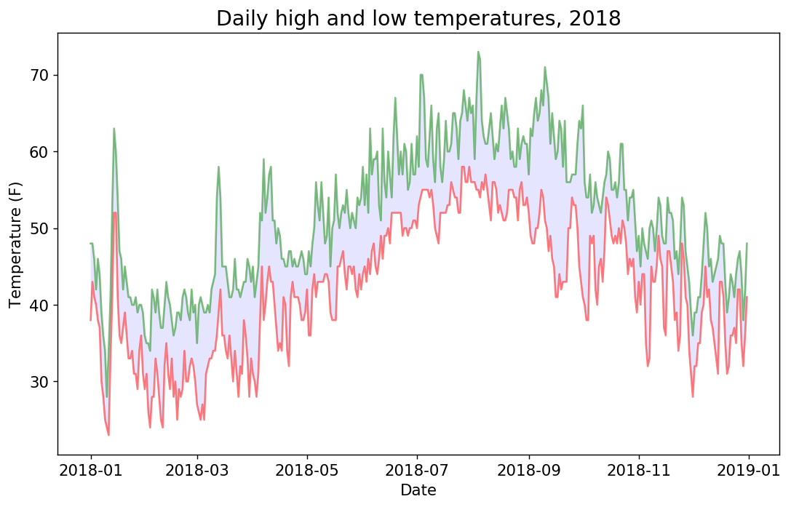
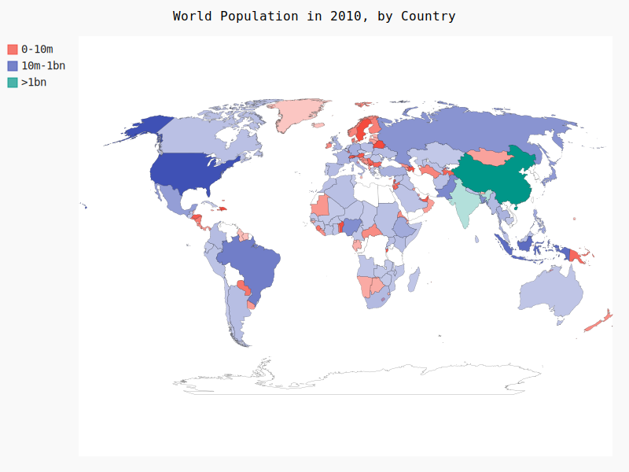

在本章中，将从网上下载数据，并对这些数据进行可视化。

访问并可视化以两种常见格式存储的数据：CSV和JSON。我们将使用Python模块csv来处理以CSV（逗号分隔的值）格式存储的天气数据，找出两个不同地区在一段时间内的最高温度和最低温度。然后，我们将使用matplotlib根据下载的数据创建一个图表，展示两个不同地区的气温变化。在后面，将使用模块json来访问以JSON格式存储的人口数据，并使用Pygal绘制一幅按国别划分的人口地图。

将能够处理各种类型和格式的数据集，并对如何创建复杂的图表有更深入的认识。

## 16.1　CSV文件格式


### 16.1.1　分析CSV文件头


```python
import csv
filename = 'sitka_weather_07-2018_simple.csv'
with open(filename) as f:
    reader = csv.reader(f)
    header_row = next(reader)
    print(header_row)
```

    ['STATION', 'NAME', 'DATE', 'PRCP', 'TAVG', 'TMAX', 'TMIN']


### 16.1.2　打印文件头及其位置


```python
import csv
filename = 'sitka_weather_07-2018_simple.csv'
with open(filename) as f:
    reader = csv.reader(f)
    header_row = next(reader)
    for index, column_header in enumerate(header_row):
        print(index, column_header)
```

    0 STATION
    1 NAME
    2 DATE
    3 PRCP
    4 TAVG
    5 TMAX
    6 TMIN


### 16.1.3　提取并读取数据


```python
import csv

# 从文件中获取最高气温
filename = 'sitka_weather_07-2018_simple.csv'
with open(filename) as f:
    reader = csv.reader(f)
    header_row = next(reader)

    highs = []
    for row in reader:
        highs.append(int(row[5]))

    print(highs)
```

    [62, 58, 70, 70, 67, 59, 58, 62, 66, 59, 56, 63, 65, 58, 56, 59, 64, 60, 60, 61, 65, 65, 63, 59, 64, 65, 68, 66, 64, 67, 65]


### 16.1.4　绘制气温图表


```python
from matplotlib import pyplot as plt
# 根据数据绘制图形
fig = plt.figure(dpi=128, figsize=(10,6))
plt.plot(highs, c="red")

# 设置图形格式
plt.title("Daily high temperatures, July 2018", fontsize=16)
plt.xlabel("", fontsize=12)
plt.ylabel("Temperature (F)", fontsize=12)
plt.tick_params(axis='both', which='major', labelsize=12)

plt.show()
```


    <matplotlib.figure.Figure at 0x7f86500e5ac8>


### 16.1.5　模块datetime


```python
import datetime
first_date = datetime.datetime.strptime('2018-07-01','%Y-%m-%d')
print(first_date)
```

    2018-07-01 00:00:00


参数的类型和含义：

| 实参 |             含义             |
| ---- | --------------------------- |
| `%A` | 星期的名称，如Monday          |
| `%B` | 月份名，如January             |
| `%m` | 用数字表示的月份（01~12）      |
| `%d` | 用数字表示月份中的一天（01~31） |
| `%Y` | 四位的年份，如2015            |
| `%y` | 两位的年份，如15              |
| `%H` | 24小时制的小时数（00~23）      |
| `%I` | 12小时制的小时数（01~12）      |
| `%p` | am或pm                       |
| `%M` | 分钟数（00~59）               |
| `%S` | 秒数（00~61）                |

### 16.1.6　在图表中添加日期


```python
import csv
import datetime
from matplotlib import pyplot as plt

filename = "sitka_weather_07-2018_simple.csv"
with open(filename) as f:
    reader = csv.reader(f)
    header_row = next(reader)
    
    dates, highs = [], []
    for row in reader:
        current_date = datetime.datetime.strptime(row[2], "%Y-%m-%d")
        dates.append(current_date)
        
        high_temperature = int(row[5])
        highs.append(high_temperature)
    #print(dates, highs)

# 根据数据绘制图形
fig = plt.figure(dpi=128, figsize=(10,6))
plt.plot(dates,highs, c="red")

# 设置图形格式
plt.title("Daily high temperatures, July 2018", fontsize=16)
plt.xlabel("", fontsize=12)
plt.ylabel("Temperature (F)", fontsize=12)
plt.tick_params(axis='both', which='major', labelsize=12)

plt.show()
```


### 16.1.7　涵盖更长的时间


```python
import csv
import datetime
from matplotlib import pyplot as plt

filename = "sitka_weather_2018_simple.csv"
with open(filename) as f:
    reader = csv.reader(f)
    header_row = next(reader)
    print(header_row)
    
    dates, highs = [], []
    for row in reader:
        current_date = datetime.datetime.strptime(row[2], "%Y-%m-%d")
        dates.append(current_date)
        
        high_temperature = int(row[5])
        highs.append(high_temperature)
    #print(dates, highs)

# 根据数据绘制图形
fig = plt.figure(dpi=128, figsize=(10,6))
plt.plot(dates,highs, c="g")

# 设置图形格式
plt.title("Daily high temperatures, 2018", fontsize=16)
plt.xlabel("Date", fontsize=12)
plt.ylabel("Temperature (F)", fontsize=12)
plt.tick_params(axis='both', which='major', labelsize=12)

plt.show()
```

    ['STATION', 'NAME', 'DATE', 'PRCP', 'TAVG', 'TMAX', 'TMIN']


### 16.1.8　再绘制一个数据系列


```python
import csv
import datetime
from matplotlib import pyplot as plt

filename = "sitka_weather_2018_simple.csv"
with open(filename) as f:
    reader = csv.reader(f)
    header_row = next(reader)
    print(header_row)
    
    dates, highs, lows = [], [], []
    for row in reader:
        current_date = datetime.datetime.strptime(row[2], "%Y-%m-%d")
        dates.append(current_date)
        
        high_temperature = int(row[5])
        highs.append(high_temperature)
        
        low_temperature = int(row[6])
        lows.append(low_temperature)
    #print(dates, highs)

# 根据数据绘制图形
fig = plt.figure(dpi=128, figsize=(10,6))
plt.plot(dates, highs, c="g")
plt.plot(dates, lows, c="r")
# 设置图形格式
plt.title("Daily high and low temperatures, 2018", fontsize=16)
plt.xlabel("Date", fontsize=12)
plt.ylabel("Temperature (F)", fontsize=12)
plt.tick_params(axis='both', which='major', labelsize=12)

plt.show()
```

    ['STATION', 'NAME', 'DATE', 'PRCP', 'TAVG', 'TMAX', 'TMIN']


### 16.1.9　给图表区域着色


```python
# 根据数据绘制图形
fig = plt.figure(dpi=128, figsize=(10,6))
plt.plot(dates, highs, c="g", alpha=0.5)
plt.plot(dates, lows, c="r", alpha=0.5)
# 此处的alpha代表透明度，数值大小的顺序不会影响颜色的填充
plt.fill_between(dates, lows, highs, facecolor="b", alpha=0.1)
# 设置图形格式
plt.title("Daily high and low temperatures, 2018", fontsize=16)
plt.xlabel("Date", fontsize=12)
plt.ylabel("Temperature (F)", fontsize=12)
plt.tick_params(axis='both', which='major', labelsize=12)

plt.show()
```





### 16.1.10　错误检查


```python
import csv
import datetime
from matplotlib import pyplot as plt

filename = "death_valley_2018_simple.csv"
with open(filename) as f:
    reader = csv.reader(f)
    header_row = next(reader)
    print(header_row)
    
    dates, highs, lows = [], [], []
    for row in reader:
        current_date = datetime.datetime.strptime(row[2], "%Y-%m-%d")
        dates.append(current_date)
        
        high_temperature = int(row[4])
        highs.append(high_temperature)
        
        low_temperature = int(row[5])
        lows.append(low_temperature)
    #print(dates, highs)

# 根据数据绘制图形
fig = plt.figure(dpi=128, figsize=(10,6))
plt.plot(dates, highs, c="g")
plt.plot(dates, lows, c="r")
# 设置图形格式
plt.title("Daily high and low temperatures, 2018", fontsize=16)
plt.xlabel("Date", fontsize=12)
plt.ylabel("Temperature (F)", fontsize=12)
plt.tick_params(axis='both', which='major', labelsize=12)

plt.show()
```

    ['STATION', 'NAME', 'DATE', 'PRCP', 'TMAX', 'TMIN', 'TOBS']


    ---------------------------------------------------------------------------

    ValueError                                Traceback (most recent call last)

    <ipython-input-10-46ece91559a7> in <module>()
         14         dates.append(current_date)
         15 
    ---> 16         high_temperature = int(row[4])
         17         highs.append(high_temperature)
         18 


    ValueError: invalid literal for int() with base 10: ''


> 该traceback指出，Python无法处理其中一天的最高气温，因为它无法将空字符串（' ' ）转换为整数。


```python
import csv
import datetime
from matplotlib import pyplot as plt

filename = "death_valley_2018_simple.csv"
with open(filename) as f:
    reader = csv.reader(f)
    header_row = next(reader)
    print(header_row)
    
    dates, highs, lows = [], [], []
    for row in reader:
        try:
            current_date = datetime.datetime.strptime(row[2], "%Y-%m-%d")
            high_temperature = int(row[4])
            low_temperature = int(row[5])
            
            # 这里要注意插值需要同时处理，否则会因为数据量不同而导致无法作图
            dates.append(current_date)
            highs.append(high_temperature)
            lows.append(low_temperature)
        except ValueError:
            print(current_date, 'Missing data', row)
    #print(len(highs), len(lows))

# 根据数据绘制图形
fig = plt.figure(dpi=128, figsize=(10,6))
plt.plot(dates, highs, c="g")
plt.plot(dates, lows, c="r")
# 设置图形格式
plt.title("Daily high and low temperatures, 2018", fontsize=16)
plt.xlabel("Date", fontsize=12)
plt.ylabel("Temperature (F)", fontsize=12)
plt.tick_params(axis='both', which='major', labelsize=12)

plt.show()
```

    ['STATION', 'NAME', 'DATE', 'PRCP', 'TMAX', 'TMIN', 'TOBS']
    2018-02-18 00:00:00 Missing data ['USC00042319', 'DEATH VALLEY, CA US', '2018-02-18', '0.00', '', '', '']


### **练习：**
16-1 旧金山 ：旧金山的气温更接近于锡特卡还是死亡谷呢？请绘制一个显示旧金山最高气温和最低气温的图表，并进行比较。可从http://www.wunderground.com/history/ 下载几乎任何地方的天气数据。为此，请输入相应的地方和日期范围，滚动到页面底部，找到名为Comma-Delimited File的链接，再单击该链接，将数据存储为CSV文件。
> 网站上找了一圈没找到

16-2 比较锡特卡和死亡谷的气温 ：在有关锡特卡和死亡谷的图表中，气温刻度反映了数据范围的不同。为准确地比较锡特卡和死亡谷的气温范围，需要在y 轴上使用相同的刻度。为此，请修改图16-5和图16-6所示图表的y 轴设置，对锡特卡和死亡谷的气温范围进行直接比较（你也可以对任何两个地方的气温范围进行比较）。你还可以尝试在一个图表中呈现这两个数据集。

16-3 降雨量 ：选择你感兴趣的任何地方，通过可视化将其降雨量呈现出来。为此，可先只涵盖一个月的数据，确定代码正确无误后，再使用一整年的数据来运行它。

16-4 探索 ：生成一些图表，对你好奇的任何地方的其他天气数据进行研究。


```python
print("-----16-2-----")
import csv
import datetime
from matplotlib import pyplot as plt

filename = "death_valley_2018_simple.csv"
with open(filename) as f:
    reader = csv.reader(f)
    header_row = next(reader)
    print(header_row)
    
    dates, highs, lows = [], [], []
    for row in reader:
        try:
            current_date = datetime.datetime.strptime(row[2], "%Y-%m-%d")
            high_temperature = int(row[4])
            low_temperature = int(row[5])
            
            # 这里要注意插值需要同时处理，否则会因为数据量不同而导致无法作图
            dates.append(current_date)
            highs.append(high_temperature)
            lows.append(low_temperature)
        except ValueError:
            print(current_date, 'Missing data', row)
    #print(len(highs), len(lows))

# 根据数据绘制图形
fig = plt.figure(dpi=128, figsize=(10,6))
plt.plot(dates, highs, c="y")
plt.plot(dates, lows, c="r")

filename = "sitka_weather_2018_simple.csv"
with open(filename) as f:
    reader = csv.reader(f)
    header_row = next(reader)
    print(header_row)
    
    dates, highs, lows = [], [], []
    for row in reader:
        try:
            current_date = datetime.datetime.strptime(row[2], "%Y-%m-%d")
            high_temperature = int(row[5])
            low_temperature = int(row[6])
            
            # 这里要注意插值需要同时处理，否则会因为数据量不同而导致无法作图
            dates.append(current_date)
            highs.append(high_temperature)
            lows.append(low_temperature)
        except ValueError:
            print(current_date, 'Missing data', row)

plt.plot(dates, highs, c="blue")
plt.plot(dates, lows, c="black")
            
# 设置图形格式
plt.title("Daily high and low temperatures, 2018", fontsize=16)
plt.xlabel("Date", fontsize=12)
plt.ylabel("Temperature (F)", fontsize=12)
plt.tick_params(axis='both', which='major', labelsize=12)

# 事实证明我想多了，会自动补齐缺失值
plt.show()
```

    -----16-2-----
    ['STATION', 'NAME', 'DATE', 'PRCP', 'TMAX', 'TMIN', 'TOBS']
    2018-02-18 00:00:00 Missing data ['USC00042319', 'DEATH VALLEY, CA US', '2018-02-18', '0.00', '', '', '']
    ['STATION', 'NAME', 'DATE', 'PRCP', 'TAVG', 'TMAX', 'TMIN']


## 16.2 制作世界人口地图：JSON格式

### 16.2.1　下载世界人口数据
将文件population_data.json复制到本章程序所在的文件夹中，这个文件包含全球大部分国家1960~2010年的人口数据。Open Knowledge Foundation（http://data.okfn.org/ ）提供了大量可以免费使用的数据集，这些数据就来自其中一个数据集。

### 16.2.2　提取相关的数据


```python
import json

# 将数据加载到一个列表中
filename = 'population_json.json'
with open(filename) as f:
    pop_data = json.load(f)


print_count = 0
# 打印每个国家2010年的人口数量
for pop_dict in pop_data:
    if pop_dict['Year'] == 2010 and print_count < 10:
        country_name = pop_dict['Country Name']
        population = pop_dict['Value']
        
        print_count += 1
        print("{}: {}".format(country_name, population))
```

    Arab World: 356508908.0
    Caribbean small states: 6984096.0
    Central Europe and the Baltics: 104543801.0
    Early-demographic dividend: 2908808244.36223
    East Asia & Pacific: 2205614879.0
    East Asia & Pacific (excluding high income): 1964691596.0
    East Asia & Pacific (IDA & IBRD countries): 1940064830.0
    Euro area: 336151479.0
    Europe & Central Asia: 889016221.0
    Europe & Central Asia (excluding high income): 403470694.0


### 16.2.3　将字符串转换为数字值
> 在最新的版本里，已经很智能了，没有这个问题。


```python
import json

# 将数据加载到一个列表中
filename = 'population_json.json'
with open(filename) as f:
    pop_data = json.load(f)


print_count = 0
# 打印每个国家2010年的人口数量
for pop_dict in pop_data:
    if pop_dict['Year'] == 2010 and print_count < 10:
        country_name = pop_dict['Country Name']
        population = float(pop_dict['Value'])
        
        print_count += 1
        print("{}: {}".format(country_name, population))
```

    Arab World: 356508908.0
    Caribbean small states: 6984096.0
    Central Europe and the Baltics: 104543801.0
    Early-demographic dividend: 2908808244.36223
    East Asia & Pacific: 2205614879.0
    East Asia & Pacific (excluding high income): 1964691596.0
    East Asia & Pacific (IDA & IBRD countries): 1940064830.0
    Euro area: 336151479.0
    Europe & Central Asia: 889016221.0
    Europe & Central Asia (excluding high income): 403470694.0


### 16.2.4　获取两个字母的国别码
Pygal中的地图制作工具要求数据为特定的格式：用国别码表示国家，以及用数字表示人口数量。处理地理政治数据时，经常需要用到几个标准化国别码集。population_json.json中包含的是三个字母的国别码，但Pygal使用两个字母的国别码。我们需要想办法根据国家名获取两个字母的国别码。

Pygal使用的国别码存储在模块i18n （internationalization的缩写）中。字典COUNTRIES 包含的键和值分别为两个字母的国别码和国家名。


```python
from pygal_maps_world.i18n import COUNTRIES

print_count = 0
for country_code in sorted(COUNTRIES.keys()):
    print(country_code, COUNTRIES[country_code])
    print_count += 1
    if print_count >= 10:
        break
```

    ad Andorra
    ae United Arab Emirates
    af Afghanistan
    al Albania
    am Armenia
    ao Angola
    aq Antarctica
    ar Argentina
    at Austria
    au Australia


```python
def get_country_code(country_name):
    """根据指定的国家，返回Pygal使用的两个字母的国别码"""
    for code, name in COUNTRIES.items():
        if name == country_name:
            return code
    # 如果没有找到指定的国家，就返回None
    return None

print(get_country_code('Andorra'))
print(get_country_code('United Arab Emirates'))
print(get_country_code('Arab World'))
```

    ad
    ae
    None


```python
import json

# 将数据加载到一个列表中
filename = 'population_json.json'
with open(filename) as f:
    pop_data = json.load(f)


print_count = 0
# 打印每个国家2010年的人口数量
for pop_dict in pop_data:
    if pop_dict['Year'] == 2010 and print_count < 10:
        country_name = pop_dict['Country Name']
        population = float(pop_dict['Value'])
        
        code = get_country_code(country_name)
        if code:
            print("{}: {}".format(code, population))
            print_count += 1
        else:
            print("{}, code is {}, population:{}".format(country_name, code, population))
        
        
```

    Arab World, code is None, population:356508908.0
    Caribbean small states, code is None, population:6984096.0
    Central Europe and the Baltics, code is None, population:104543801.0
    Early-demographic dividend, code is None, population:2908808244.36223
    East Asia & Pacific, code is None, population:2205614879.0
    East Asia & Pacific (excluding high income), code is None, population:1964691596.0
    East Asia & Pacific (IDA & IBRD countries), code is None, population:1940064830.0
    Euro area, code is None, population:336151479.0
    Europe & Central Asia, code is None, population:889016221.0
    Europe & Central Asia (excluding high income), code is None, population:403470694.0
    Europe & Central Asia (IDA & IBRD countries), code is None, population:441513488.0
    European Union, code is None, population:504421131.0
    Fragile and conflict affected situations, code is None, population:438737943.0
    Heavily indebted poor countries (HIPC), code is None, population:630127436.0
    High income, code is None, population:1149511694.0
    IBRD only, code is None, population:4427798045.36223
    IDA & IBRD total, code is None, population:5801348625.36223
    IDA blend, code is None, population:452947421.0
    IDA only, code is None, population:920603159.0
    IDA total, code is None, population:1373550580.0
    Late-demographic dividend, code is None, population:2181250143.0
    Latin America & Caribbean, code is None, population:596477846.0
    Latin America & Caribbean (excluding high income), code is None, population:569737872.0
    Latin America & the Caribbean (IDA & IBRD countries), code is None, population:580246796.0
    Least developed countries: UN classification, code is None, population:848791962.0
    Low & middle income, code is None, population:5781145005.36223
    Low income, code is None, population:560007444.0
    Lower middle income, code is None, population:2756602745.0
    Middle East & North Africa, code is None, population:388376106.0
    Middle East & North Africa (excluding high income), code is None, population:335581557.0
    Middle East & North Africa (IDA & IBRD countries), code is None, population:331770455.0
    Middle income, code is None, population:5221137561.36223
    North America, code is None, population:343418591.0
    OECD members, code is None, population:1242391523.0
    Other small states, code is None, population:26269542.0
    Pacific island small states, code is None, population:2214096.0
    Post-demographic dividend, code is None, population:1075140985.0
    Pre-demographic dividend, code is None, population:739082260.0
    Small states, code is None, population:35467734.0
    South Asia, code is None, population:1630729920.0
    South Asia (IDA & IBRD), code is None, population:1630729920.0
    Sub-Saharan Africa, code is None, population:877023136.362228
    Sub-Saharan Africa (excluding high income), code is None, population:876933366.362228
    Sub-Saharan Africa (IDA & IBRD countries), code is None, population:877023136.362228
    Upper middle income, code is None, population:2464534816.36223
    World, code is None, population:6930656699.36223
    af: 28803167.0
    al: 2913021.0
    dz: 36117637.0
    American Samoa, code is None, population:55637.0
    ad: 84449.0
    ao: 23369131.0
    Antigua and Barbuda, code is None, population:94661.0
    ar: 41223889.0
    am: 2877311.0
    Aruba, code is None, population:101669.0
    au: 22031750.0
    at: 8363404.0
    az: 9054332.0


### 16.2.5　制作世界地图


```python
import pygal_maps_world.maps
from IPython.display import SVG, display

wm = pygal_maps_world.maps.World()
wm.title = 'North, Central, and South America'
wm.add('North America', ['ca', 'mx', 'us'])
wm.add('Central America', ['bz', 'cr', 'gt', 'hn', 'ni', 'pa', 'sv'])
wm.add('South America', ['ar', 'bo', 'br', 'cl', 'co', 'ec', 'gf',
                         'gy', 'pe', 'py', 'sr', 'uy', 've'])

wm.render_to_file('americas.svg')
display(SVG(wm.render()))
```


### 16.2.6　在世界地图上呈现数字数据


```python
import pygal_maps_world.maps
from IPython.display import SVG, display

wm = pygal_maps_world.maps.World()
wm.title = 'Populations of Countries in North America'
wm.add('North America', {'ca': 34126000, 'us': 309349000, 'mx': 113423000})
wm.render_to_file('americas.svg')
display(SVG(wm.render()))
```


### 16.2.7　绘制完整的世界人口地图


```python
import json
import pygal_maps_world
from IPython.display import SVG, display

dc_population = dict()
for pop_dict in pop_data:
    if pop_dict['Year'] == 2010:
        country = pop_dict['Country Name']
        population = float(pop_dict['Value'])
        code = get_country_code(country)
        if code:
            dc_population[code] = population

wm = pygal_maps_world.maps.World()
wm.title = 'World Population in 2010, by Country'
wm.add('2010', dc_population)
wm.render_to_file('americas.svg')
display(SVG(wm.render()))
```


### 16.2.8　根据人口数量将国家分组


```python
# 根据人口数量将所有的国家分成三组
cc_pops_1, cc_pops_2, cc_pops_3 = {}, {}, {}
for cc, pop in dc_population.items():
    if pop < 10000000:
        cc_pops_1[cc] = pop
    elif pop < 1000000000:
        cc_pops_2[cc] = pop
    else:
        cc_pops_3[cc] = pop

# 看看每组分别包含多少个国家
print(len(cc_pops_1), len(cc_pops_2), len(cc_pops_3))

wm = pygal_maps_world.maps.World()
wm.title = 'World Population in 2010, by Country'
wm.add('0-10m', cc_pops_1)
wm.add('10m-1bn', cc_pops_2)
wm.add('>1bn', cc_pops_3)

wm.render_to_file('world_population.svg')
display(SVG(wm.render()))
```

    81 71 2





### 16.2.9　使用Pygal设置世界地图的样式


```python
import pygal
wm_style = pygal.style.RotateStyle('#336699')
wm = pygal_maps_world.maps.World(style=wm_style)
wm.title = 'World Population in 2010, by Country'
wm.add('0-10m', cc_pops_1)
wm.add('10m-1bn', cc_pops_2)
wm.add('>1bn', cc_pops_3)

wm.render_to_file('world_population.svg')
display(SVG(wm.render()))
```


Pygal样式存储在模块style 中，从这个模块中导入了样式RotateStyle。创建这个类的实例时，需要提供一个实参——十六进制的RGB颜色；Pygal将根据指定的颜色为每组选择颜色。
十六进制格式的RGB颜色是一个以井号（#）打头的字符串，后面跟着6个字符，其中前两个字符表示红色分量，接下来的两个表示绿色分量，最后两个表示蓝色分量。每个分量的取值范围为00（没有相应的颜色）~FF（包含最多的相应颜色）。

### 16.2.10　加亮颜色主题


```python
from pygal.style import LightColorizedStyle
wm_style = LightColorizedStyle
wm = pygal_maps_world.maps.World(style=wm_style, base_style=LightColorizedStyle)

wm.title = 'World Population in 2010, by Country'
wm.add('0-10m', cc_pops_1)
wm.add('10m-1bn', cc_pops_2)
wm.add('>1bn', cc_pops_3)

wm.render_to_file('world_population.svg')
display(SVG(wm.render()))
```


### **练习：**
16-5 涵盖所有国家 ：本节制作人口地图时，对于大约12个国家，程序不能自动确定其两个字母的国别码。请找出这些国家，在字典COUNTRIES 中找到它们的国别码；然后，对于每个这样的国家，都在get_country_code() 中添加一个if-elif 代码块，以返回其国别码：

if country_name == 'Yemen, Rep.'
    return 'ye'
elif --snip--

将这些代码放在遍历COUNTRIES 的循环和语句return None 之间。完成这样的修改后，你看到的地图将更完整。

16-6 国内生产总值 ：Open Knowledge Foundation提供了一个数据集，其中包含全球各国的国内生产总值（GDP），可在http://data.okfn.org/data/core/gdp/ 找到这个数据集。请下载这个数据集的JSON版本，并绘制一个图表，将全球各国最近一年的GDP呈现出来。

16-7 选择你自己的数据 ：世界银行（The World Bank）提供了很多数据集，其中包含有关全球各国的信息。请访问http://data.worldbank.org/indicator/ ，并找到一个你感兴趣的数据集。单击该数据集，再单击链接Download Data并选择CSV。你将收到三个CSV文件，其中两个包含字样Metadata，你应使用第三个CSV文件。编写一个程序，生成一个字典，它将两个字母的Pygal国别码作为键，并将你从这个文件中选择的数据作为值。使用Worldmap 制作一个地图，在其中呈现这些数据，并根据你的喜好设置这个地图的样式。

16-8 测试模块country_codes ：我们编写模块country_codes 时，使用了print 语句来核实get_country_code() 能否按预期那样工作。请利用你在第11章学到的知识，为这个函数编写合适的测试。


```python
print("-----16-5-----")
# 找出未能识别的国别码
import json
import pygal_maps_world.maps
from IPython.display import SVG, display
from pygal_maps_world.i18n import COUNTRIES

def get_country_code(country_name):
    for code, name in COUNTRIES.items():
        if country_name == name:
            return code
        elif country_name == "Hong Kong SAR, China":
            return "hk"
        elif country_name == "Iran, Islamic Rep.":
            return "ir"
        elif country_name == "Korea, Dem. People’s Rep.":
            return "kp"
        elif country_name == "Korea, Rep.":
            return "kr"
        elif country_name == "Macao SAR, China":
            return "mo"
        elif country_name == "Libya":
            return "ly"
        elif country_name == "Bolivia":
            return "bo"
        elif country_name == "Congo, Dem. Rep.":
            return "cd"
        elif country_name == "Congo, Rep.":
            return "cg"
        elif country_name == "Dominica":
            return "do"
        elif country_name == "Egypt, Arab Rep.":
            return "eg"
        elif country_name == "Gambia, The":
            return "gm"
        elif country_name == "Kyrgyz Republic":
            return "kg"
        elif country_name == "Lao PDR":
            return "la"
        elif country_name == "Macedonia, FYR":
            return "mk"
        elif country_name == "Moldova":
            return "md"
        elif country_name == "Slovak Republic":
            return "sk"
        elif country_name == "Tanzania":
            return "tz"
        elif country_name == "Venezuela, RB":
            return "ve"
        elif country_name == "Vietnam":
            return "vn"
        elif country_name == "Yemen, Rep.":
            return "ye"
    return None

file_population = 'population_json.json'
with open(file_population) as f:
    list_population = json.load(f)

dc_population = dict()
for dc_pop in list_population:
    if dc_pop['Year'] == 2012:
        #print(get_country_code(dc_pop['Country Name']))
        population = float(dc_pop['Value'])
        code = get_country_code(dc_pop['Country Name'])
        if code:
            dc_population[code] = population

# 根据人口数量将所有的国家分成三组
cc_pops_1, cc_pops_2, cc_pops_3 = {}, {}, {}
for cc, pop in dc_population.items():
    if pop < 10000000:
        cc_pops_1[cc] = pop
    elif pop < 1000000000:
        cc_pops_2[cc] = pop
    else:
        cc_pops_3[cc] = pop

# 看看每组分别包含多少个国家
print(len(cc_pops_1), len(cc_pops_2), len(cc_pops_3))

wm = pygal_maps_world.maps.World()
wm.title = 'World Population in 2010, by Country'
wm.add('0-10m', cc_pops_1)
wm.add('10m-1bn', cc_pops_2)
wm.add('>1bn', cc_pops_3)

wm.render_to_file('world_population.svg')
display(SVG(wm.render()))
```

    -----16-5-----
    89 82 2


```python
print("-----16-6-----")
# 找出未能识别的国别码
import json
from pygal_maps_world.i18n import COUNTRIES
from datapackage import Package

def get_country_code(country_name):
    for code, name in COUNTRIES.items():
        if country_name == name:
            return code
        elif country_name == "Hong Kong SAR, China":
            return "hk"
        elif country_name == "Iran, Islamic Rep.":
            return "ir"
        elif country_name == "Korea, Dem. People’s Rep.":
            return "kp"
        elif country_name == "Korea, Rep.":
            return "kr"
        elif country_name == "Macao SAR, China":
            return "mo"
        elif country_name == "Libya":
            return "ly"
        elif country_name == "Bolivia":
            return "bo"
        elif country_name == "Congo, Dem. Rep.":
            return "cd"
        elif country_name == "Congo, Rep.":
            return "cg"
        elif country_name == "Dominica":
            return "do"
        elif country_name == "Egypt, Arab Rep.":
            return "eg"
        elif country_name == "Gambia, The":
            return "gm"
        elif country_name == "Kyrgyz Republic":
            return "kg"
        elif country_name == "Lao PDR":
            return "la"
        elif country_name == "Macedonia, FYR":
            return "mk"
        elif country_name == "Moldova":
            return "md"
        elif country_name == "Slovak Republic":
            return "sk"
        elif country_name == "Tanzania":
            return "tz"
        elif country_name == "Venezuela, RB":
            return "ve"
        elif country_name == "Vietnam":
            return "vn"
        elif country_name == "Yemen, Rep.":
            return "ye"
    return None

# Get Data with the datahub API
pack_gdp = Package('https://datahub.io/core/gdp/datapackage.json')
print(pack_gdp.resource_names)
# print processed tabular data (if exists any)
for res_gdp in pack_gdp.resources:
    if res_gdp.descriptor['datahub']['type'] == 'derived/json':
        #print(resource.read())
        json_gdp = res_gdp.raw_read()
        list_gdp = json.loads(json_gdp)
```

    -----16-6-----
    ['validation_report', 'gdp_csv', 'gdp_json', 'gdp_zip', 'gdp_csv_preview', 'gdp']


```python
import pygal_maps_world.maps
dict_gdp = dict()
for dc_gdp in list_gdp:
    if dc_gdp['Year'] == 2012:
        #print(get_country_code(dc_pop['Country Name']))
        gdp = float(dc_gdp['Value'])
        code = get_country_code(dc_gdp['Country Name'])
        if code:
            dict_gdp[code] = gdp

# 根据人口数量将所有的国家分成三组
cc_gdp_1, cc_gdp_2, cc_gdp_3 = {}, {}, {}
for cc, gdp in dict_gdp.items():
    if gdp < 1000000000:
        cc_gdp_1[cc] = gdp
    elif gdp < 1000000000000:
        cc_gdp_2[cc] = gdp
    else:
        cc_gdp_3[cc] = gdp

# 看看每组分别包含多少个国家
print(len(cc_gdp_1), len(cc_gdp_2), len(cc_gdp_3))

wm = pygal_maps_world.maps.World()
wm.title = 'World GDP in 2012, by Country'
wm.add('0-10m', cc_gdp_1)
wm.add('10m-1bn', cc_gdp_2)
wm.add('>1bn', cc_gdp_3)

wm.render_to_file('world_gdp_2012.svg')
display(SVG(wm.render()))
```

    3 150 15


----

欢迎关注我的微信公众号一起交流！